# Introdução

Informações básicas do projeto.

## Projeto: 911 - Sistema de Apoio aos Serviços Emergenciais

Repositório GitHub: https://github.com/ICEI-PUC-Minas-PMGES-TI/pmg-es-2025-2-ti1-2401100-servemergencia

Membros da equipe:

•  Pedro Henrique Amaral Morais

•  Moises Carvalho Alves Teixeira

•  Samuel Henrique Alvarenga e Lopes

•  Gabriel Eduardo de Oliveira Martins

•  Gabriel Rangel de Toledo

•  Gustavo Fitipaldi Moreira

## A documentação do projeto é estruturada da seguinte forma:

### •  Introdução

### •  Contexto

### •  Product Discovery

### •  Product Design

### •  Metodologia

### •  Solução

### •  Referências Bibliográficas


✅ Documentação de Design Thinking (MIRO) https://miro.com/app/board/uXjVJSvRFqM=/

## Contexto 
***
 Os serviços emergenciais têm a função de oferecer ajuda rápida em situações críticas, 
quando a vida das pessoas, seus bens ou até o meio ambiente estão em risco. Eles 
são indispensáveis porque garantem atendimento imediato em casos como 
acidentes, doenças graves, incêndios, crimes ou desastres, impedindo que os 
problemas se tornem ainda maiores. Além de salvar vidas, também ajudam a diminuir 
prejuízos e trazem à população a tranquilidade de saber que existe apoio disponível 
em momentos de urgência. Assim, sua importância vai além do socorro imediato, pois 
representam cuidado, proteção e segurança para toda a sociedade.

## Problema 
***
 A ausência de serviços emergenciais traz sérios problemas para a sociedade, já que 
o atraso no atendimento em situações críticas, como acidentes, crises de saúde, 
incêndios ou episódios de violência, coloca muitas vidas em risco. Sem esse suporte 
imediato, aumentam as chances de mortes evitáveis e de sequelas físicas e 
emocionais. Além disso, os prejuízos materiais e ambientais tendem a ser maiores, 
pois o controle de incêndios, enchentes e outros desastres se torna mais difícil. Em 
resumo, a falta desses serviços afeta diretamente a segurança, a saúde e a qualidade 
de vida da população.


## Objetivos 
***
 O objetivo do nosso trabalho é encontrar formas de reduzir os problemas causados 
pela falta de acesso aos serviços emergenciais. A ideia é pensar em alternativas que 
tornem o atendimento mais rápido e eficiente em casos de urgência, ajudando a salvar 
vidas, evitar maiores prejuízos e trazer mais segurança para a população.

## Justificativa 
***
 A escolha desse tema foi feita porque percebemos a importância que os serviços 
emergenciais têm no dia a dia da sociedade. Como acidentes, problemas de saúde 
graves, incêndios ou situações de violência, a rapidez no atendimento pode significar 
a diferença entre salvar uma vida ou não. No entanto, muitas vezes o acesso a esse 
tipo de serviço é limitado ou demorado, o que aumenta os riscos e os prejuízos para 
a população. Por isso, decidimos trabalhar nessa questão, buscando alternativas que 
possam tornar o atendimento mais ágil e eficiente, contribuindo para mais segurança 
e qualidade  de vida

## Público-Alvo 
***
 O público-alvo deste trabalho são cidadãos que necessitam de serviços emergenciais 
em situações de risco, como acidentes, problemas de saúde graves, incêndios ou 
episódios de violência. Além disso, também se estende a órgãos públicos e 
instituições responsáveis pelo atendimento emergencial, como bombeiros, polícia, 
equipes médicas e defesa civil, que podem se beneficiar de ferramentas que agilizem 
a comunicação e a tomada de decisão 

# Product Discovery
***
## Etapa de Entendimento

### • Matriz CSD


### • Mapa de Stakeholders

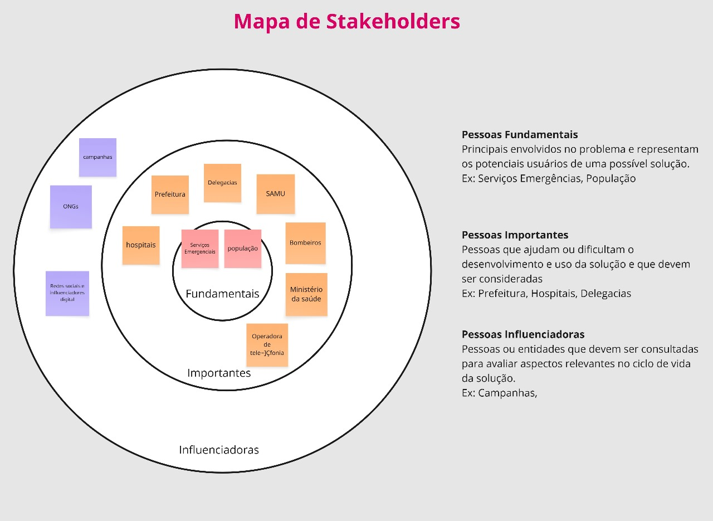

### • Entrevistas qualitativas e Highlights


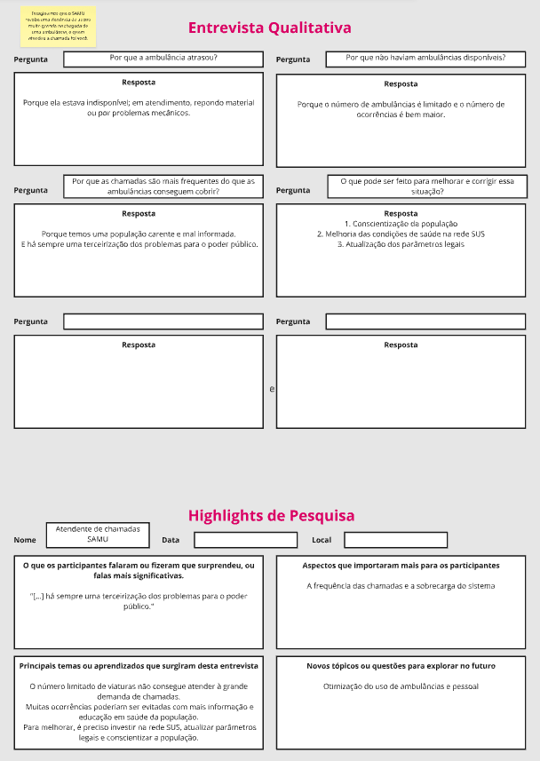

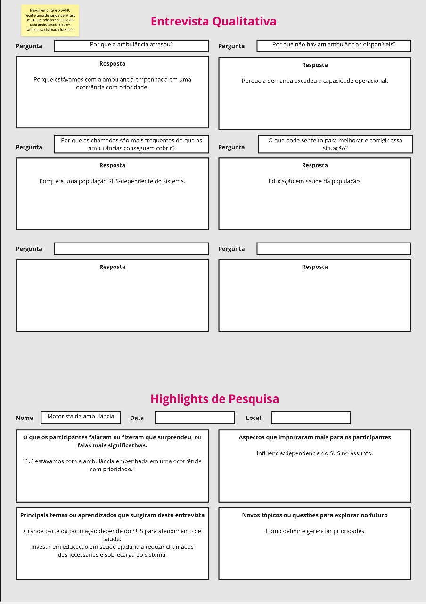

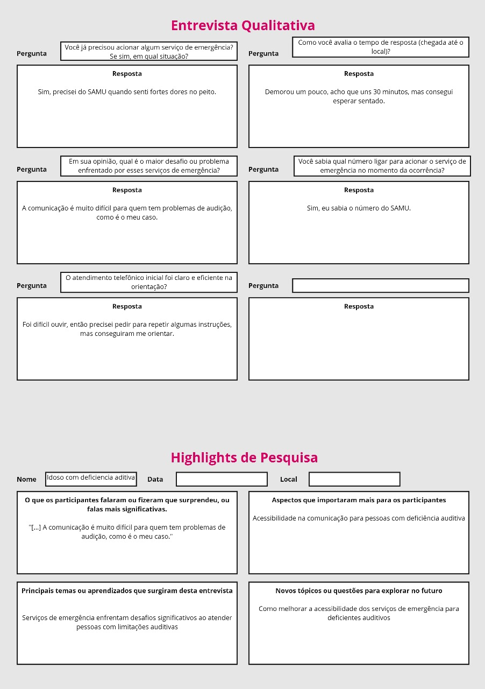

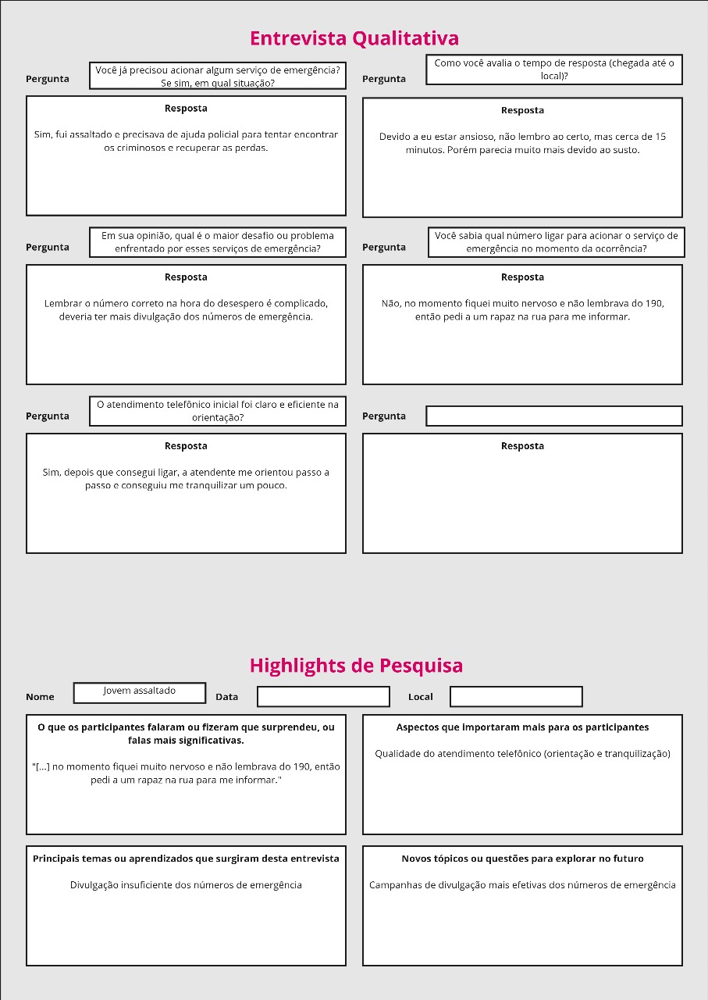

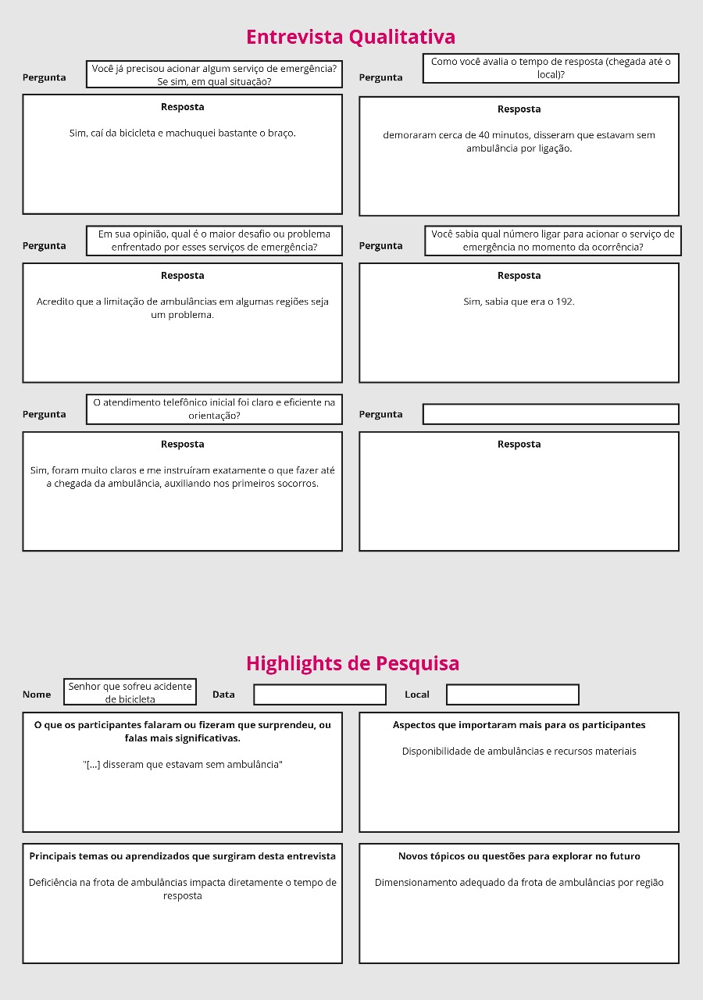


## Etapa de Definição

### • Personas e Propostas de valor


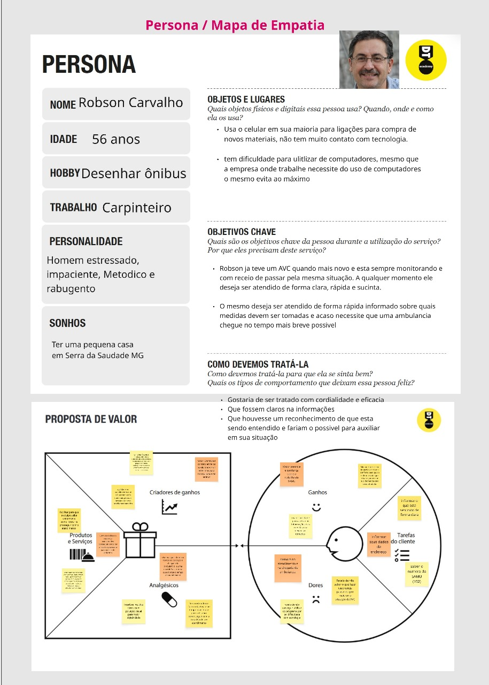


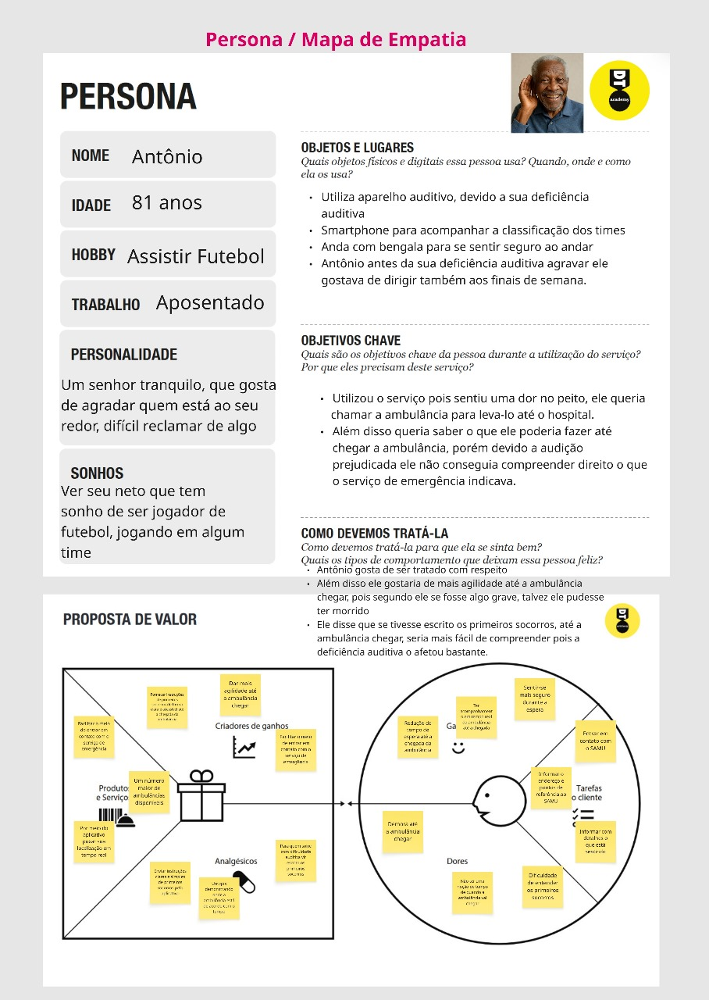

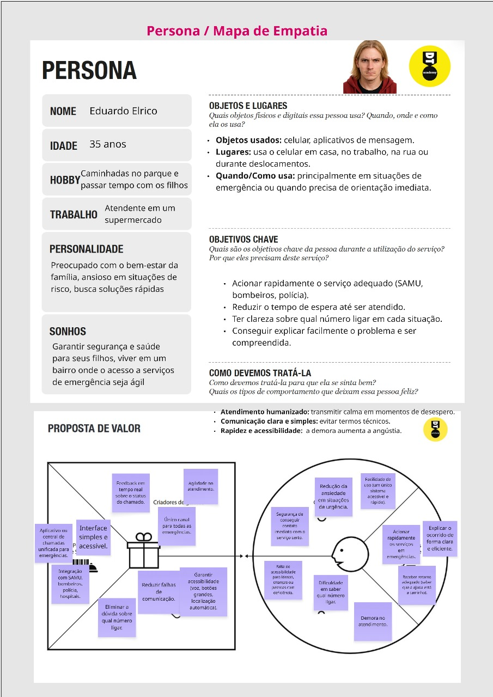

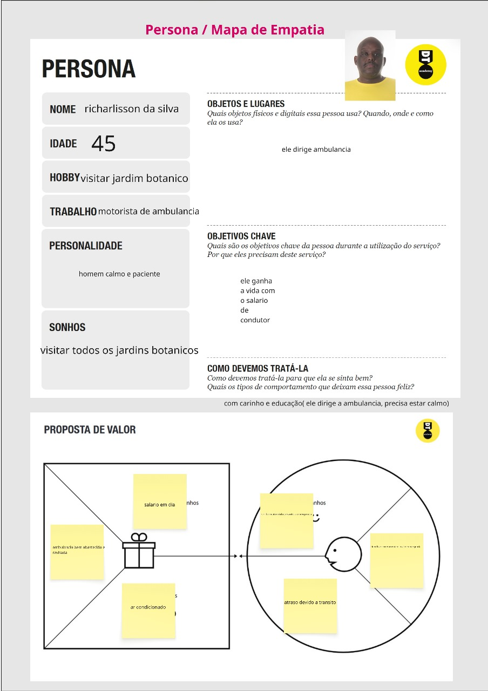


# Product Design
***
 Nesse momento, vamos transformar os insights e validações obtidos em soluções 
tangíveis e utilizáveis. Essa fase envolve a definição de uma proposta de valor, 
detalhando a prioridade de cada ideia e a consequente criação de wireframes, mockups e protótipos de alta fidelidade, que detalham a interface e a experiência do usuário.

## Histórias de Usuários:
Com base na análise das personas foram identificadas as seguintes histórias de usuários:
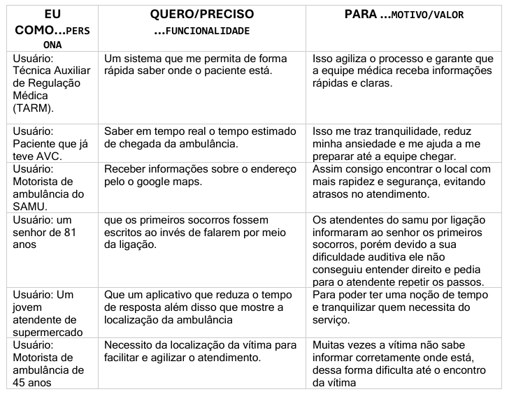


## Requisitos 
***
As tabelas que se seguem apresentam os requisitos funcionais e não funcionais que 
detalham o escopo do projeto.


### Requisitos não Funcionais
***
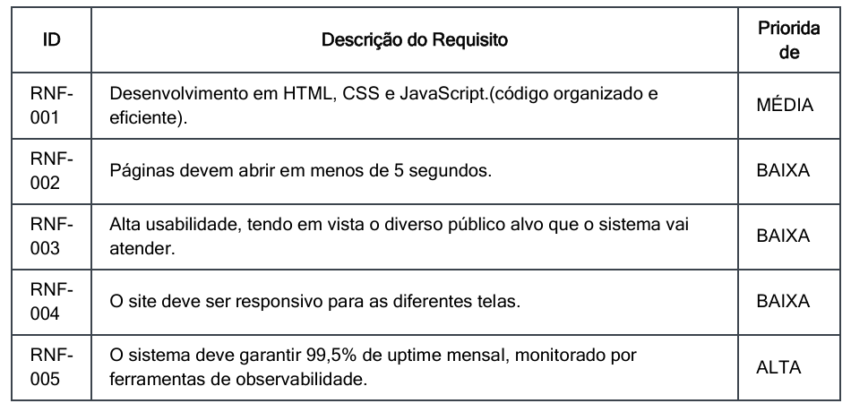

### Projeto de Interface 
***

## Protótipo de Logo:


Protótipos de Tela

# HOME-PAGE 
***
## Tela inicial do sistema


## TELA DE LOGIN

## Tela para login e/ou cadastro de usuário.

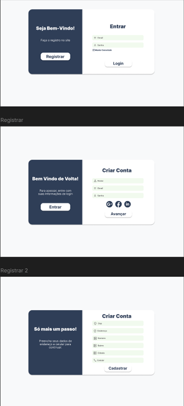

## TELA DE CADASTRO: Seleção

Como será apresentado seu cadastro e oção para cadastrar contatos de emêrgencias 

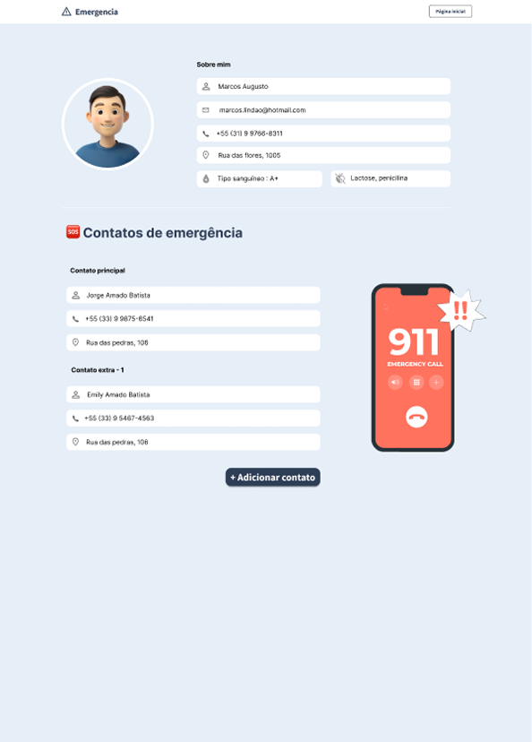

## TELA INICIAL 
Tela inicial do sistema, mostra ao usuário informações principais:

• Serviços Emergênciais disponiveis

• Instruções Básicas

• Perguntas Frequentes  


## TELA DE CONSULTA: 
A partir da escolha de qualquer serviço disponível o usuario e direcionado para as possíveis seguintes telas.

• SAMU

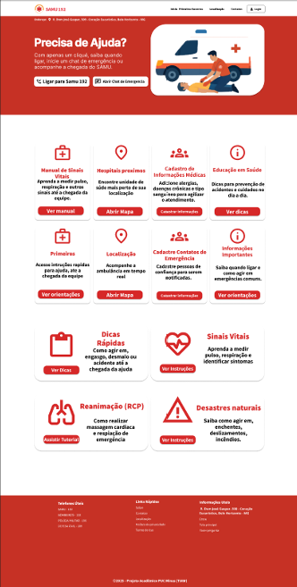

• POLÍCIA MILITAR

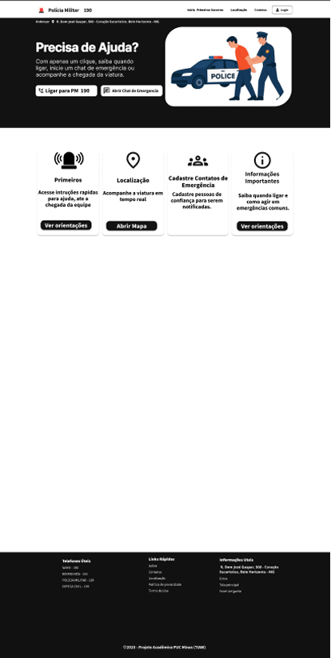

• BOMBEIROS

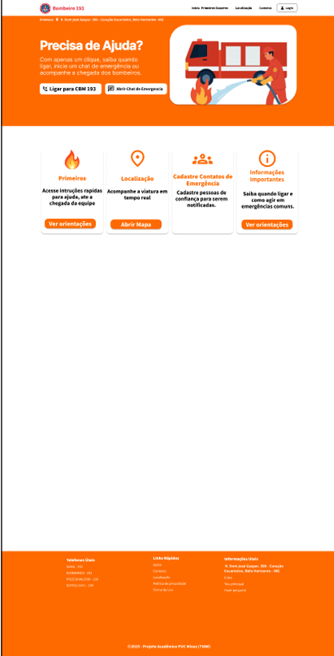

• DEFESA CIVIL

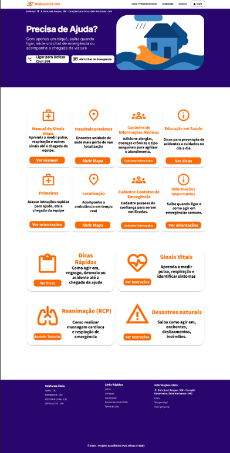


# USERFLOW 

Ao entrar no site o usuário é direcionado a tela inicial e tem a opção ou não de continuar navegando de com ou sem o login realizado. 
A diferença é que sem a realização do login o usuário terá acesso limitado a alguns canais nosso site, restringido a apenas informações básicas.


Protótipo Interativo
***

https://www.figma.com/design/c6SUAjKDS64F9qXDZXcR0t/911?node-id=123&t=MW8Cz2YgUP0rPvgo-0 

# Metodologia

Detalhes sobre a organização do grupo e o ferramental empregado.

## Ferramentas


Relação de ferramentas empregadas pelo grupo durante o projeto.

| Ambiente                    | Plataforma | Link de acesso                                     |
| --------------------------- | ---------- | -------------------------------------------------- |
| Processo de Design Thinking | Miro       | https://miro.com/app/board/uXjVJSvRFqM=/      |
| Repositório de código     | GitHub     |https://github.com/ICEI-PUC-Minas-PMGES-TI/pmg-es-2025-2-ti1-2401100-servemergencia.git      |
| Hospedagem do site          | Render     | https://site.render.com/XXXXXXX  |
| Protótipo Interativo       | MarvelApp  | https://marvelapp.com/XXXXXXX    |
|                             |            |                                                    |


## Gerenciamento do Projeto
***
Adotamos uma versão adaptada da metodologia scrum, utilizando o GitHub Projects 
para coordenar e registrar o avanço da equipe. Durante o início do processo 
realizamos um extenso Design Thinking com diversas etapas como mapeamento de 
escopo, entrevistas qualitativas, criação de personas, histórias de usuário, brainstorm 
de ideias, delimitação de funcionalidades e levantamento de requisitos. 


# Solução Implementada

Esta seção apresenta todos os detalhes da solução criada no projeto.

## Vídeo do Projeto

O vídeo a seguir traz uma apresentação do problema que a equipe está tratando e a proposta de solução. ⚠️ EXEMPLO ⚠️

[](https://www.youtube.com/embed/70gGoFyGeqQ)

> ⚠️ **APAGUE ESSA PARTE ANTES DE ENTREGAR SEU TRABALHO**
>
> O video de apresentação é voltado para que o público externo possa conhecer a solução. O formato é livre, sendo importante que seja apresentado o problema e a solução numa linguagem descomplicada e direta.
>
> Inclua um link para o vídeo do projeto.

## Funcionalidades

Esta seção apresenta as funcionalidades da solução.Info

##### Funcionalidade 1 - Cadastro de Contatos ⚠️ EXEMPLO ⚠️

Permite a inclusão, leitura, alteração e exclusão de contatos para o sistema

* **Estrutura de dados:** [Contatos](#ti_ed_contatos)
* **Instruções de acesso:**
  * Abra o site e efetue o login
  * Acesse o menu principal e escolha a opção Cadastros
  * Em seguida, escolha a opção Contatos
* **Tela da funcionalidade**:


> ⚠️ **APAGUE ESSA PARTE ANTES DE ENTREGAR SEU TRABALHO**
>
> Apresente cada uma das funcionalidades que a aplicação fornece tanto para os usuários quanto aos administradores da solução.
>
> Inclua, para cada funcionalidade, itens como: (1) titulos e descrição da funcionalidade; (2) Estrutura de dados associada; (3) o detalhe sobre as instruções de acesso e uso.

## Estruturas de Dados

Descrição das estruturas de dados utilizadas na solução com exemplos no formato JSON.Info

##### Estrutura de Dados - Contatos   ⚠️ EXEMPLO ⚠️

Contatos da aplicação

```json
  {
    "id": 1,
    "nome": "Leanne Graham",
    "cidade": "Belo Horizonte",
    "categoria": "amigos",
    "email": "Sincere@april.biz",
    "telefone": "1-770-736-8031",
    "website": "hildegard.org"
  }
  
```

##### Estrutura de Dados - Usuários  ⚠️ EXEMPLO ⚠️

Registro dos usuários do sistema utilizados para login e para o perfil do sistema

```json
  {
    id: "eed55b91-45be-4f2c-81bc-7686135503f9",
    email: "admin@abc.com",
    id: "eed55b91-45be-4f2c-81bc-7686135503f9",
    login: "admin",
    nome: "Administrador do Sistema",
    senha: "123"
  }
```

> ⚠️ **APAGUE ESSA PARTE ANTES DE ENTREGAR SEU TRABALHO**
>
> Apresente as estruturas de dados utilizadas na solução tanto para dados utilizados na essência da aplicação quanto outras estruturas que foram criadas para algum tipo de configuração
>
> Nomeie a estrutura, coloque uma descrição sucinta e apresente um exemplo em formato JSON.
>
> **Orientações:**
>
> * [JSON Introduction](https://www.w3schools.com/js/js_json_intro.asp)
> * [Trabalhando com JSON - Aprendendo desenvolvimento web | MDN](https://developer.mozilla.org/pt-BR/docs/Learn/JavaScript/Objects/JSON)

## Módulos e APIs

Esta seção apresenta os módulos e APIs utilizados na solução

**Images**:

* Unsplash - [https://unsplash.com/](https://unsplash.com/) ⚠️ EXEMPLO ⚠️

**Fonts:**

* Icons Font Face - [https://fontawesome.com/](https://fontawesome.com/) ⚠️ EXEMPLO ⚠️

**Scripts:**

* jQuery - [http://www.jquery.com/](http://www.jquery.com/) ⚠️ EXEMPLO ⚠️
* Bootstrap 4 - [http://getbootstrap.com/](http://getbootstrap.com/) ⚠️ EXEMPLO ⚠️

> ⚠️ **APAGUE ESSA PARTE ANTES DE ENTREGAR SEU TRABALHO**
>
> Apresente os módulos e APIs utilizados no desenvolvimento da solução. Inclua itens como: (1) Frameworks, bibliotecas, módulos, etc. utilizados no desenvolvimento da solução; (2) APIs utilizadas para acesso a dados, serviços, etc.

# Referências

As referências utilizadas no trabalho foram:

* SOBRENOME, Nome do autor. Título da obra. 8. ed. Cidade: Editora, 2000. 287 p ⚠️ EXEMPLO ⚠️

> ⚠️ **APAGUE ESSA PARTE ANTES DE ENTREGAR SEU TRABALHO**
>
> Inclua todas as referências (livros, artigos, sites, etc) utilizados no desenvolvimento do trabalho.
>
> **Orientações**:
>
> - [Formato ABNT](https://www.normastecnicas.com/abnt/trabalhos-academicos/referencias/)
> - [Referências Bibliográficas da ABNT](https://comunidade.rockcontent.com/referencia-bibliografica-abnt/)
